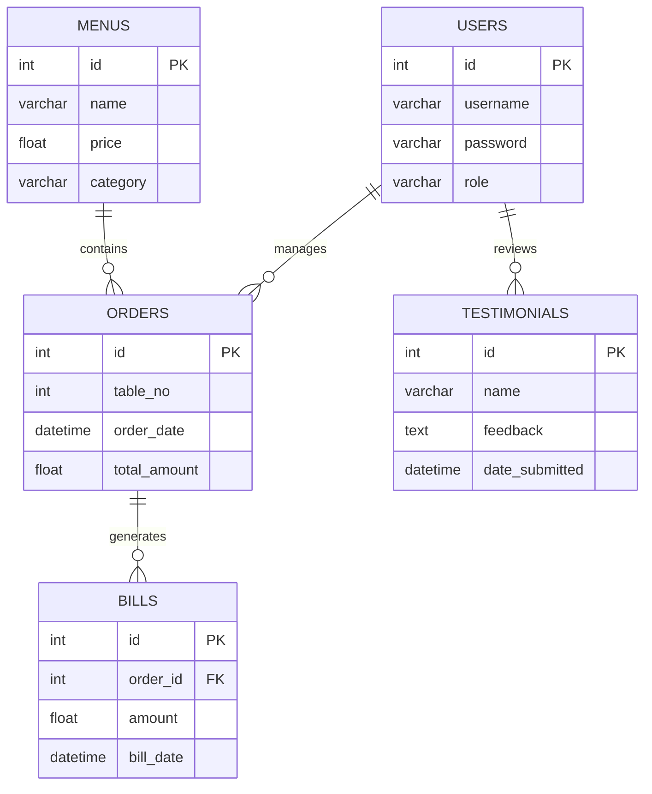

## 📚 `README.md` for GitHub:

```markdown
# 🍽️ Foodzy - Restaurant Management System
```


```
Foodzy is a full-stack **Restaurant Management System** built using Flask, PostgreSQL, and vanilla HTML/CSS. It provides seamless CRUD operations for managing:
- 🍴 Menus
- 📝 Orders
- 💳 Billing
- 🌟 Customer Testimonials

---

## 🎯 **Features**

✅ Role-based Admin & Staff Panels  
✅ Manage Menus, Orders, and Tables  
✅ Customer Feedback with Testimonial Management  
✅ Beautiful Responsive UI  
✅ Secure Login System & CRUD APIs  

---

## 🗂️ **Project Structure**

```
Foodzy/
├── app/
│   ├── __init__.py          # Flask App Initialization
│   ├── models/              # SQLAlchemy ORM Models
│   ├── routes/              # All Flask Routes
│   │   ├── routes.py
│   └── static/
│       ├── assets/
│       └── css, js, images/
├── templates/               # HTML Pages
├── sql/                     # DB Initialization Scripts
├── venv/                    # Virtual Environment
└── run.py                   # Main App Runner
```

---

## ⚙️ **Setup & Installation**

### 1. Clone Repository
```bash
git clone https://github.com/yourusername/Foodzy.git
cd Foodzy
```

### 2. Create Virtual Environment
```bash
# For Windows
python -m venv venv
venv\Scripts\activate

# For Mac/Linux
python3 -m venv venv
source venv/bin/activate
```

### 3. Install Dependencies
```bash
pip install -r requirements.txt
```

### 4. Set Up PostgreSQL Database
- Create a database `foodzy_db`
- Update DB config in `app/__init__.py`

### 5. Run Application
```bash
python run.py
```

- Open your browser at `http://127.0.0.1:5000/`

---

## 📦 **Database Design**

### 🗄️ Tables & Schema
- `users` - Admin and Staff Login
- `menus` - Menu Management
- `orders` - Customer Orders
- `bills` - Billing Data
- `testimonials` - Customer Feedback

---

## 📊 **Entity-Relationship Diagram (ERD)**



---

## 🚀 **API Endpoints**

| Method   | Endpoint         | Description                |
|----------|-----------------|----------------------------|
| `GET`    | `/`               | Home Page                  |
| `GET`    | `/menu`           | Menu Listing               |
| `POST`   | `/add_order`      | Place New Order            |
| `POST`   | `/add_testimonial`| Add Customer Feedback      |
| `GET`    | `/admin`          | Admin Dashboard            |

---

## 🎨 **UI Preview**


---

## 📄 **License**
This project is licensed under the MIT License.

---

## 🌐 **Live Demo (Optional)**
[Check Live Deployment](https://foodzy-render.app/)  
```

---

## 📚 `DB DESIGN.md` (DMD)

```markdown
# 🗂️ Foodzy - Database Design (DMD)

---

## 🎯 **Database Overview**
```
The `foodzy_db` database contains 5 primary tables:
1. `users` - Admin/Staff User Data
2. `menus` - Menu Information
3. `orders` - Customer Order Details
4. `bills` - Billing and Payment Info
5. `testimonials` - Customer Reviews

---

## 📊 **Table Descriptions**

### 1. `users` Table
```sql
CREATE TABLE users (
    id SERIAL PRIMARY KEY,
    username VARCHAR(50) NOT NULL,
    password VARCHAR(255) NOT NULL,
    role VARCHAR(20) CHECK (role IN ('admin', 'staff')) NOT NULL
);
```

### 2. `menus` Table
```sql
CREATE TABLE menus (
    id SERIAL PRIMARY KEY,
    name VARCHAR(100) NOT NULL,
    price FLOAT NOT NULL,
    category VARCHAR(50)
);
```

### 3. `orders` Table
```sql
CREATE TABLE orders (
    id SERIAL PRIMARY KEY,
    table_no INT NOT NULL,
    order_date TIMESTAMP DEFAULT NOW(),
    total_amount FLOAT NOT NULL
);
```

### 4. `bills` Table
```sql
CREATE TABLE bills (
    id SERIAL PRIMARY KEY,
    order_id INT REFERENCES orders(id),
    amount FLOAT NOT NULL,
    bill_date TIMESTAMP DEFAULT NOW()
);
```

### 5. `testimonials` Table
```sql
CREATE TABLE testimonials (
    id SERIAL PRIMARY KEY,
    name VARCHAR(50) NOT NULL,
    feedback TEXT NOT NULL,
    date_submitted TIMESTAMP DEFAULT NOW()
);
```

---

## 🔗 **Relationships**

- `users` ↔️ `orders` - One-to-Many  
- `menus` ↔️ `orders` - Many-to-Many  
- `orders` ↔️ `bills` - One-to-One  
- `users` ↔️ `testimonials` - One-to-Many  

---

## 📡 **Test Data Examples**

### 1. Insert Admin/Staff Users
```sql
INSERT INTO users (username, password, role)
VALUES
('admin1', 'hashed_password1', 'admin'),
('staff1', 'hashed_password2', 'staff');
```

### 2. Insert Sample Menus
```sql
INSERT INTO menus (name, price, category)
VALUES
('Pasta', 250.00, 'Main Course'),
('Pizza', 300.00, 'Main Course'),
('Brownie', 150.00, 'Dessert');
```

### 3. Insert Sample Orders
```sql
INSERT INTO orders (table_no, total_amount)
VALUES
(5, 750.00),
(3, 300.00);
```

---
